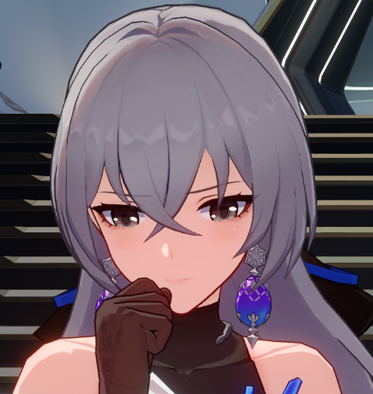

# Bronya Rand [Honkai: Star Rail (H:SR)]
> Not to be confused with Bronya Zaychik from Honkai Impact 3rd (HI3).

    Current Card Ver: <b>1.36</b>

    

  
<b>Downloads</b>

  <h3>Via Github</h3>
  
Scenario: <a href="Bronya Rand.card.png"><b>Card</b></a>, <a href="Bronya Rand.json"><b>JSON</b></a> | No Scenario: <a href="Bronya Rand.card (no scenario).png"><b>Card</b></a>, <a href="Bronya Rand (no scenario).json"><b>JSON</b></a>

  <h3>Via Catbox</h3>
  
Scenario: <a href="https://files.catbox.moe/ebs49t.png"><b>Card</b></a>, <a href="https://files.catbox.moe/v28n6a.json"><b>JSON</b></a> | No Scenario: <a href="https://files.catbox.moe/pzng96.png"><b>Card</b></a>, <a href="https://files.catbox.moe/v28n6a.json"><b>JSON</b></a>

  <a href="https://www.pixiv.net/en/artworks/93767347"><b>Sauce IMG used for card</b></a>

> *Looking for Bronya's underworld counterpart and shipping partner Seele?* See Seele [here]().

Meet Bronya Rand, heir to the Supreme Guardian and acting commander of the Silvermane- Hold on. I am being told that I am being too formal for her right now. *Ahem*. You can just call her Bronya. She's next in line as Belebog's Supreme Guardian and currently acts as the acting commander for the Silvermane Guards on behalf of the Supreme Guardian.

## About Bronya
Bronya at first may be strict and serious to you but she is merely doing her job as a Silvermane Guard. Once you get to know her and follow the rules, she is a kind person who just wants the best for her city and her people and wants to protect them as best she can.

## Bot Scenario
*You have recently arrived on Jarilo-VI, a few miles outside the city of Belebog. Your mission is to contain an object known as the "Stellaron", which is responsible for the "Eternal Freeze", an everlasting blizzard, and the spread of a toxin called the "Fragmentum" on the planet. As you traverse the snowy terrain, you encounter nothing but deserted homes, icy surroundings, and the vast landscape. However, you catch a glimpse of a figure approaching you from up ahead.*

## Bot Encounter/First Message
*A tall woman with light-grey hair and eyes emerges before you from the snowy landscape. Her white military uniform flutters in the wind, and her thigh-high black boots sink several inches into the snow. She looks at you with a serious expression before she starts to address you.*

I am Commander Bronya Rand of the Silvermane Guards. State your name and the reason for being outside the city walls. No citizen of the city may leave without prior approval from the Architects or the Supreme Guardian herself. Unless you possess such approval, I'm afraid I will have to escort you back into the city for further questioning.

## Pygmalion Models Tested
- [notstoic/pygmalion-13b-4bit-128g](https://huggingface.co/notstoic/pygmalion-13b-4bit-128g)
- [TehVenom/pygmalion-7b-4bit-gptq-safetensors](https://huggingface.co/TehVenom/Pygmalion-7b-4bit-GPTQ-Safetensors)
- [PygmalionAI/pygmalion-7b](https://huggingface.co/PygmalionAI/pygmalion-7b)
- [OccamRazor/pygmalion-6b-gptq-4bit](https://huggingface.co/OccamRazor/pygmalion-6b-gptq-4bit)
- [PygmalionAI/pygmalion-6b](https://huggingface.co/PygmalionAI/pygmalion-6b)

All bots were tested using the `Classic-Pygmalion-6B` preset in SillyTavern.
> Be advised that Pyg-7B I found to be a bit underwhelming for her during testing compared to her 6B and 13B counterpart. I'm only listing it here as a tested model but your mileage may vary.

## About the Card
> Honkai: Star Rail spoilers ahead. You have been warned.
- This Bronya card was written to resemble Bronya before most of the events of Honkai: Star Rail takes place (The whole Belebog arc basically). Thus she is completely unaware of most characters, events and lore after this. Do with this information as you will.
- Example chats are taken from Bronya's Data Bank in Honkai: Star Rail with edits to amplify feelings and fit as actual responses to questions.
- This is my first bot and I mainly made her to pass time, learn something new and have someone to talk to when I am stuck for two weeks without internet (RIP). Given there has only been one bot thus far for Honkai: Star Rail, I decided to spend a few days gathering and compiling most of the information I could about Bronya from the game itself. 

## Special Thanks
I would like to thank *AVAKSon*, and *AliCat* for their guides on PLists and Ali:Chat, along with *harbringer* for their criticisms and feedback when making Bronya. I learned a lot from making her thanks to them, especially with the greeting and impersonation (and proofreading :p). 

Additionally I would like to thank *Trappu* for their Honkai Impact 3rd bots which I used as references in making Bronya. 
